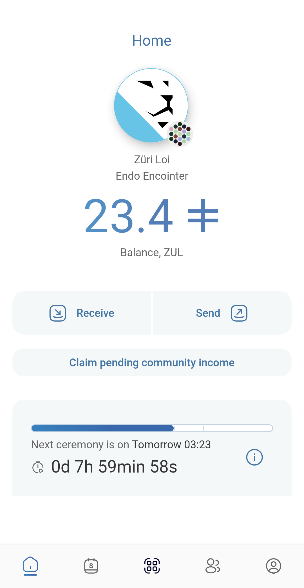
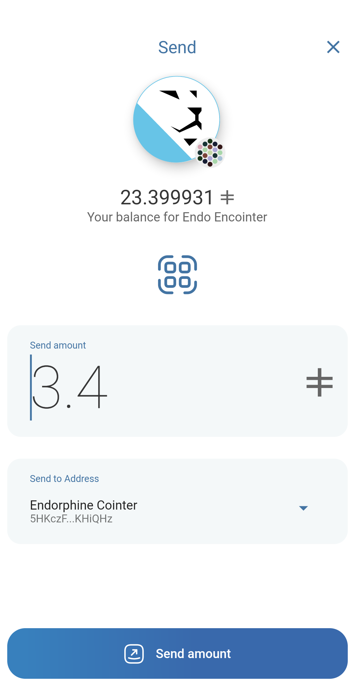

# Encointer Wallet

Encointer wallet and client for mobile phones

<p align="left">
  <a href="https://f-droid.org/packages/org.encointer.wallet/">
    
  </a>
  <a href="https://play.google.com/store/apps/details?id=org.encointer.wallet">
    
  </a>
  <a href="https://apps.apple.com/us/app/encointer-wallet/id1535471655?itsct=apps_box_badge&itscg=30200">
    
  </a>
</p>

[](https://github.com/encointer/encointer-wallet-flutter/actions/workflows/android_build_and_deploy.yml)
[](https://github.com/encointer/encointer-wallet-flutter/actions/workflows/ios_build_and_deploy.yml)
[](https://github.com/encointer/encointer-wallet-flutter/actions/workflows/unit_tests.yml)

## Overview

<p align="left">



</p>

### Requirements
- Dart sdk: ">=3.6.0 <4.0.0"
- Flutter: "3.35.0"
- Android: minSdkVersion 24
- iOS: platform 15.5, Xcode version >= 15.2

## Quick Start

```shell
./scripts/install_flutter_wrapper.sh
.flutter/bin/dart pub get
.flutter/bin/dart run melos bootstrap
.flutter/bin/flutter run --flavor dev
```

## Documentation

| Guide | Contents |
|---|---|
| [Setup](docs/setup.md) | Ubuntu, Windows, Rust toolchain, Flutter wrapper |
| [Building & Running](docs/building.md) | Run app, env vars, build APK, Android Studio config |
| [Local Services](docs/local-services.md) | Encointer node, IPFS (kubo + auth gateway), Zombienet |
| [Testing](docs/testing.md) | Unit tests, integration tests, automated screenshots |
| [Development](docs/development.md) | Formatting, code generation |
| [Releasing](docs/releasing.md) | Release flow, CI hints, F-Droid |

## Acknowledgements

This app has been built based on [polkawallet.io](https://polkawallet.io)
