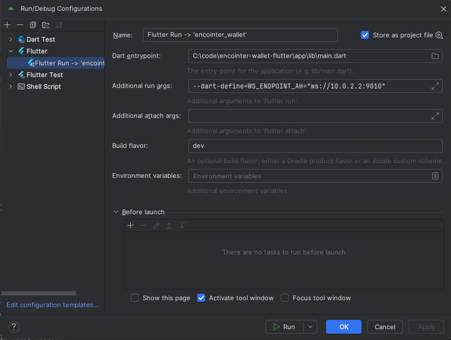

# Building & Running

## Run App

Run Android platform
```shell
.flutter/bin/dart run melos run-android
```
Run iOS platform
```shell
.flutter/bin/dart run melos run-ios
```
If you have an AVD or real device attached, you can do
```shell
.flutter/bin/flutter run --flavor dev
```

### Env Vars

Dart-define overrides can be passed to `flutter run` or `flutter build` to point the app at custom backends:

| Variable | Purpose | Default |
|---|---|---|
| `WS_ENDPOINT` | Encointer chain RPC (only local setups: gesell-dev + zombienet) | Network-specific |
| `WS_ENDPOINT_AH` | Asset Hub WS endpoint | Network-specific |
| `IPFS_GATEWAY` | IPFS read gateway | `http://10.0.2.2:8080` (Android) / `http://localhost:8080` (iOS) |
| `IPFS_AUTH_GATEWAY` | IPFS authenticated upload gateway | `http://10.0.2.2:5050` (Android) / `http://localhost:5050` (iOS) |

Example with all overrides:
```shell
.flutter/bin/flutter run --flavor dev \
  --dart-define=WS_ENDPOINT=ws://localhost:9944 \
  --dart-define=IPFS_GATEWAY=http://localhost:8080 \
  --dart-define=IPFS_AUTH_GATEWAY=http://localhost:5050
```

Below you can see how to configure Android Studio to set these environment variables.



## Build APK

You may build the App with Flutter's [Deployment Documentation](https://flutter.dev/docs).

In order to build a split APK, you can do
```shell
.flutter/bin/dart run melos build-apk-split
```

For the play store, an appbundle is preferred:
```shell
.flutter/bin/dart run melos build-appbundle-play
```

### Android Studio

To run in Android Studio a build flavor must be specified. Go to Run/Debug configurations and add the build flavor `dev` in the appropriate field. Other available values are in the `app/android/app/build.gradle` file.
